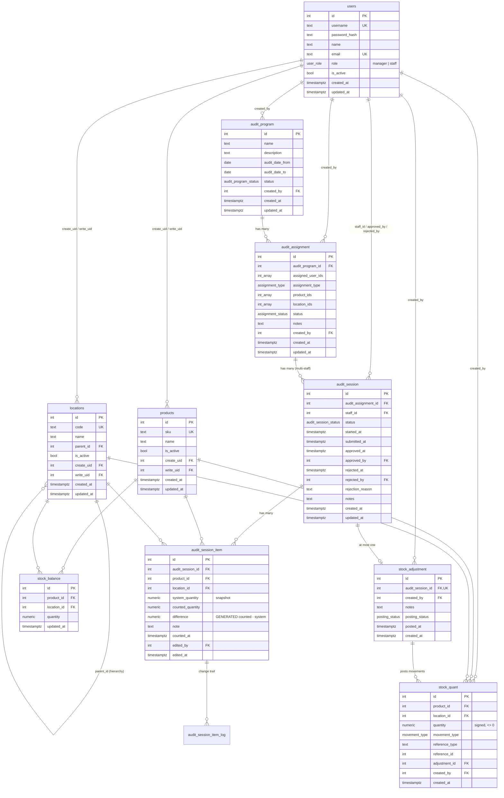
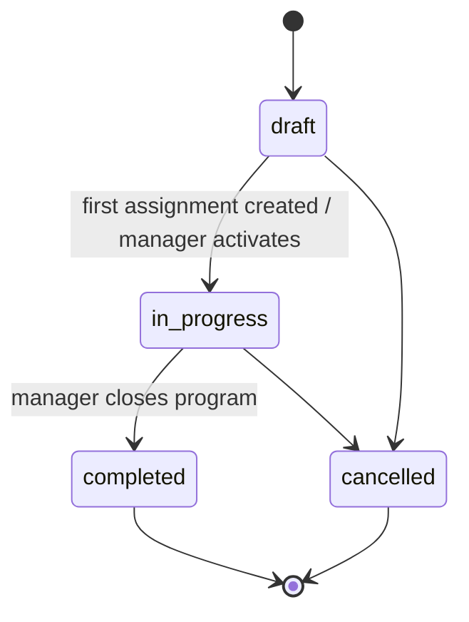
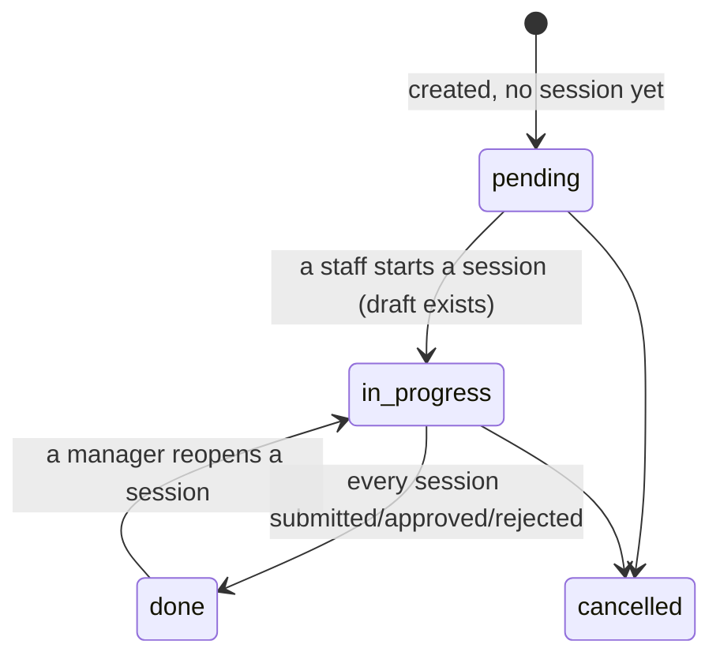
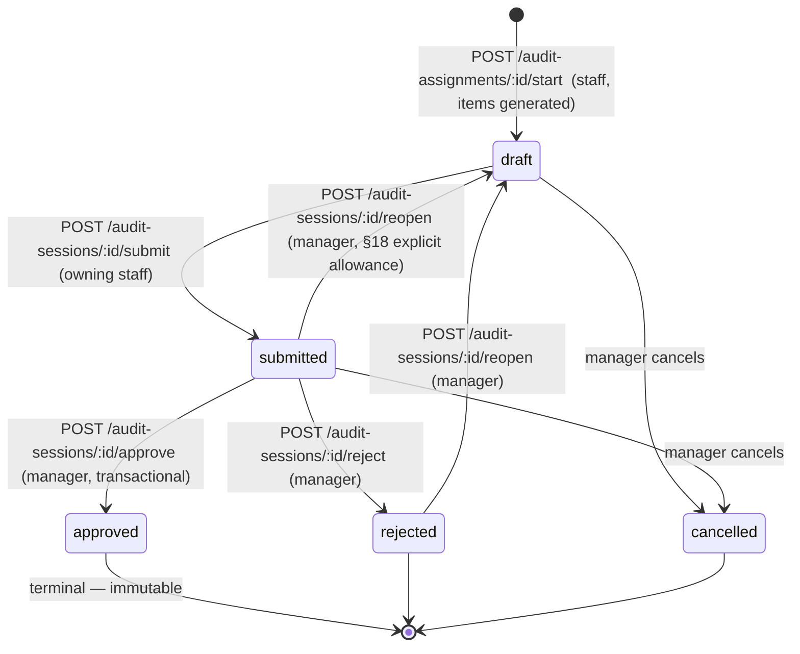
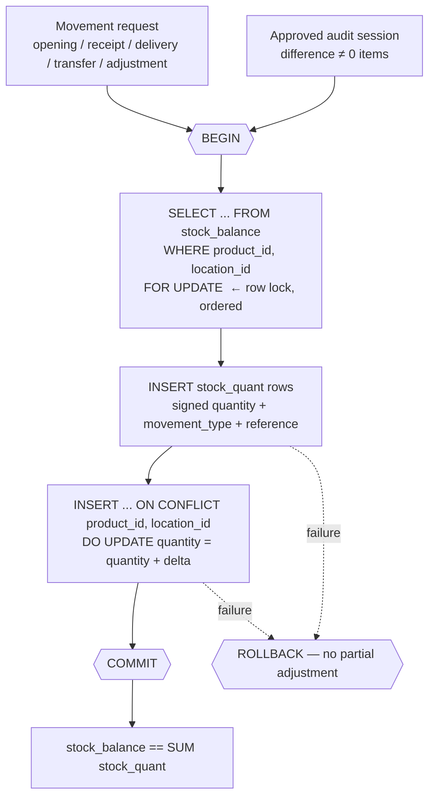

# Stock Opname System — Design Document

This document is deliverable **§36** of the requirement: it defines the ERD, schema,
relationships, state transitions, stock movement flow, API design, authorization matrix and
transaction boundaries **before** any implementation code is written.

---

## 1. Database ERD



### Design decisions worth calling out

| # | Decision | Rationale |
|---|----------|-----------|
| 1 | `audit_assignment` uses **array columns** (`assigned_user_ids`, `product_ids`, `location_ids`) | The requirement lists plural array fields (§10) and the UI mock (§32) shows several staff and several SKUs per assignment. The `product` vs `location` CHECK constraint (§10/§27) is therefore expressed on the arrays: exactly one of the two must be non-empty. |
| 2 | Arrays cannot carry foreign keys | Referential integrity for the arrays is enforced by a **constraint trigger** that verifies every id exists, is active, and (for users) has role `staff`. |
| 3 | `difference` is a **generated stored column** | §17 — the database, not the application, guarantees `counted_quantity - system_quantity`. |
| 4 | `stock_quant` is **append-only**, enforced by a trigger that rejects `UPDATE`/`DELETE` | §26/§28 — the movement ledger is the historical source of truth and must never be silently rewritten. |
| 5 | `stock_balance` is written **only** through one repository funnel (`stock.repository.postMovements`) inside the caller's transaction | §8/§16 — guarantees `stock_balance == SUM(stock_quant)` per product/location. |
| 6 | Quantities are `NUMERIC(18,3)` | Supports fractional UoM without float error. Serialized to JSON numbers at the API boundary. |
| 7 | Surrogate keys are `INTEGER`/`SERIAL` | Keeps JSON ids plain numbers (no `BigInt` serialization traps) while staying far above the row volume of this application. |
| 8 | A location assignment expands over the **location subtree** | Locations are hierarchical (§6). Assigning `Stock` audits `Rack A/B/C`; assigning the leaf `Rack A` audits exactly `Rack A`. |
| 9 | Extra table `audit_session_item_log` | §20 requires traceable manager edits with `old_value`, `new_value`, `user`, `timestamp`, `reason`. |
| 10 | Extra columns `stock_adjustment.posting_status` / `posted_at` | Phase 7 idempotency guard for the asynchronous reconciliation worker. |

---

## 2. PostgreSQL schema

The authoritative DDL lives in `backend/prisma/migrations/*/migration.sql`.
Enumerated types:

```sql
user_role            = manager | staff
movement_type        = opening | receipt | delivery | transfer_in | transfer_out | adjustment | audit_adjustment
audit_program_status = draft | in_progress | completed | cancelled
assignment_type      = product | location
assignment_status    = pending | in_progress | done | cancelled
audit_session_status = draft | submitted | approved | rejected | cancelled
posting_status       = pending | posted | failed
```

Key constraints (§27):

| Table | Constraint |
|-------|-----------|
| `users` | `UNIQUE(username)`, `UNIQUE(email)`, role enum |
| `products` | `UNIQUE(sku)` |
| `locations` | `UNIQUE(code)`, `CHECK(parent_id <> id)`, `FK parent_id → locations(id) ON DELETE RESTRICT` |
| `stock_quant` | `CHECK(quantity <> 0)`, append-only trigger, FKs `ON DELETE RESTRICT` |
| `stock_balance` | `UNIQUE(product_id, location_id)` |
| `audit_program` | `CHECK(audit_date_to >= audit_date_from)` |
| `audit_assignment` | `CHECK` product-vs-location exclusivity, `CHECK(array_length(assigned_user_ids,1) >= 1)`, no NULL array elements, reference trigger |
| `audit_session` | partial `UNIQUE(audit_assignment_id, staff_id) WHERE status = 'draft'`, partial `UNIQUE(audit_assignment_id) WHERE status = 'approved'`, status/timestamp coherence CHECKs |
| `audit_session_item` | `UNIQUE(audit_session_id, product_id, location_id)`, `CHECK(counted_quantity >= 0)`, generated `difference` |
| `stock_adjustment` | `UNIQUE(audit_session_id)` |

Indexes: `stock_quant(product_id, location_id, id DESC)`, `stock_quant(adjustment_id)`,
`stock_quant(created_at DESC)`, `stock_balance(location_id)`, `audit_assignment(audit_program_id)`,
GIN indexes on the three array columns, `audit_session(audit_assignment_id, status)`,
`audit_session(staff_id, status)`, `audit_session_item(audit_session_id)`.

---

## 3. Table relationships

```
users ─┬─ creates ─► products / locations / audit_program / audit_assignment
       └─ performs ─► audit_session (staff_id) ─── approves/rejects (manager)

locations ─ parent_id ─► locations            (WH → Stock → Rack A/B/C)

audit_program 1───N audit_assignment 1───N audit_session 1───N audit_session_item
                                                    │
                                                    └─1───0..1 stock_adjustment 1───N stock_quant ──► stock_balance
```

Traceability chain required by §24 is a pure join path:

```
stock_quant.adjustment_id → stock_adjustment.audit_session_id → audit_session.audit_assignment_id
  → audit_assignment.audit_program_id → audit_program        (and audit_session.staff_id → users)
```

---

## 4. Audit state transitions

### 4.1 `audit_program`



### 4.2 `audit_assignment` (derived from its sessions)



### 4.3 `audit_session` — the core machine



Invariants enforced in the database, not just in code:

* at most **one** `approved` session per assignment (partial unique index);
* at most **one** `draft` session per (assignment, staff) pair (partial unique index);
* `approved` ⇒ `approved_at`/`approved_by` present; `rejected` ⇒ `rejected_at`/`rejected_by` present;
* approving a session **auto-rejects** its sibling `draft`/`submitted` sessions with reason
  "Another session was approved for this assignment" (§21).

---

## 5. Stock movement flow

`stock_quant` is the ledger; `stock_balance` is the cache. There is exactly one write path.



Transfers post two rows in one transaction: `transfer_out` (negative, source) and
`transfer_in` (positive, destination). Balance rows are locked in a deterministic order
(`product_id, location_id`) so concurrent postings cannot deadlock.

Audit-driven flow (§21/§23):

```
audit_session_item.difference = 0   → no movement at all
difference > 0                      → stock_quant + difference, movement_type = audit_adjustment
difference < 0                      → stock_quant - |difference|, movement_type = audit_adjustment
every row carries adjustment_id = stock_adjustment.id, reference_type='audit_session', reference_id=session.id
```

---

## 6. API endpoint design

Base: `/api`. All responses `{ data, meta? }`; errors `{ error: { code, message, details? } }`.

| Method | Path | Role | Notes |
|--------|------|------|-------|
| POST | `/auth/login` | public | returns JWT + user |
| GET | `/auth/me` | any | current user |
| GET/POST | `/users` | manager | list / create |
| GET/PUT/DELETE | `/users/:id` | manager | DELETE = soft (`is_active=false`) |
| GET/POST | `/products` | any / manager | list includes `quantity` = Σ balances (§5) |
| GET/PUT/DELETE | `/products/:id` | any / manager / manager | DELETE = soft |
| GET | `/products/:id/stock` | any | per-location balances |
| GET/POST | `/locations` | any / manager | `?tree=1` returns hierarchy |
| GET/PUT/DELETE | `/locations/:id` | any / manager / manager | DELETE = soft |
| GET | `/stock` | any | current stock, filter by product/location |
| GET | `/stock/:productId/:locationId` | any | single balance + recent movements |
| GET | `/stock/movements` | any | ledger history, filterable, paginated |
| POST | `/stock/movements` | manager | create movement (receipt/delivery/transfer/opening/adjustment) |
| GET | `/stock/movements/:id` | any | movement + full audit traceability chain (§24) |
| GET | `/stock/consistency` | manager | balance vs ledger verification report |
| GET/POST | `/audit-programs` | any / manager | staff sees programs they are assigned to |
| GET/PUT | `/audit-programs/:id` | any / manager | |
| GET | `/audit-programs/:id/dashboard` | manager | counts per §32 |
| GET/POST | `/audit-programs/:id/assignments` | any / manager | |
| GET/PUT | `/audit-assignments/:id` | any / manager | |
| GET | `/audit-assignments/:id/comparison` | manager | side-by-side staff counts (§14) |
| GET | `/audit-assignments/my` | staff | own assignments (§18) |
| POST | `/audit-assignments/:id/start` | staff | creates session + items, snapshot |
| GET | `/audit-sessions` | any | manager: all; staff: own |
| GET | `/audit-sessions/:id` | owner staff / manager | |
| GET/PUT | `/audit-sessions/:id/items` | owner staff / manager | PUT = bulk save counts |
| POST | `/audit-sessions/:id/submit` | owner staff | |
| POST | `/audit-sessions/:id/approve` | manager | transactional, idempotent |
| POST | `/audit-sessions/:id/reject` | manager | requires reason |
| POST | `/audit-sessions/:id/reopen` | manager | submitted/rejected → draft |
| PUT | `/audit-session-items/:id` | owner staff (draft) / manager (pre-approval) | logged |
| GET | `/audit-session-items/:id/logs` | manager | change trail |
| GET | `/stock-adjustments` | manager | list |
| GET | `/stock-adjustments/:id` | manager | adjustment + movements + session |

---

## 7. Authorization matrix

`M` = manager, `S` = staff, `S*` = staff only for their own records. Enforced by
`requireAuth` + `requireRole` middleware **and** ownership checks in the service layer (§31).

| Capability | Manager | Staff |
|---|:--:|:--:|
| Login / read own profile | ✅ | ✅ |
| Manage users | ✅ | ❌ |
| Manage products | ✅ | ❌ (read only) |
| Manage locations | ✅ | ❌ (read only) |
| View current stock / movement history | ✅ | ✅ |
| Create stock movements directly | ✅ | ❌ |
| Create / edit audit programs | ✅ | ❌ (read assigned) |
| Create / edit audit assignments | ✅ | ❌ |
| View own assignments | ✅ | ✅ S* |
| Start audit session | ❌ (staff action) | ✅ S* |
| Edit counted quantity of own draft session | ✅ (pre-approval) | ✅ S* |
| Submit session | ❌ | ✅ S* |
| View any session | ✅ | ✅ S* |
| Compare sessions of an assignment | ✅ | ❌ |
| Edit items of a submitted session | ✅ | ❌ |
| Approve / reject / reopen session | ✅ | ❌ |
| Create stock adjustment directly | ❌ (only via approval) | ❌ |
| View stock adjustments | ✅ | ❌ |

---

## 8. Transaction boundaries

| Operation | Boundary | Locking | Failure mode |
|---|---|---|---|
| Login | none | — | — |
| Master-data CRUD | single-statement | — | — |
| Soft delete | single statement + reference check | — | 409 if hard-delete attempted with history |
| `POST /stock/movements` | **one tx**: insert quant rows → upsert balances | `SELECT ... FOR UPDATE` on `stock_balance` rows, ordered by `(product_id, location_id)` | full ROLLBACK; ledger and cache stay in sync |
| `POST /audit-assignments/:id/start` | **one tx**: authorize → insert session → resolve scope → snapshot balances → bulk insert items | insert of session guarded by partial unique index (concurrent double-start ⇒ 409) | ROLLBACK ⇒ no orphan session |
| `PUT /audit-sessions/:id/items` (bulk save) | **one tx**: lock session, verify status/ownership, update items, write change logs | `SELECT ... FOR UPDATE` on `audit_session` | ROLLBACK |
| `POST /audit-sessions/:id/submit` | **one tx**: lock session → status check → set `submitted` → recompute assignment status | `FOR UPDATE` on session | ROLLBACK |
| `POST /audit-sessions/:id/approve` | **one tx** (§21): `SELECT ... FOR UPDATE` session → verify `submitted` → validate items → `INSERT stock_adjustment` (unique on `audit_session_id` = idempotency guard) → **[sync mode]** insert `stock_quant` for non-zero differences + upsert `stock_balance` (balance rows locked in order) → set session `approved` + `approved_by/at` → auto-reject sibling sessions → set assignment `done` → COMMIT. **[async mode, Phase 7]** the movement posting is deferred to a BullMQ job keyed by `adjustment:<id>`; the worker repeats the same posting inside its own transaction and short-circuits when `posting_status = 'posted'`. | `FOR UPDATE` on session; partial unique index `WHERE status='approved'`; `UNIQUE(audit_session_id)` on `stock_adjustment` | any failure ⇒ ROLLBACK, **no partial stock adjustment**; duplicate request ⇒ same result, no second adjustment (idempotent) |
| `POST /audit-sessions/:id/reject` | **one tx**: lock session → verify not approved → set `rejected` | `FOR UPDATE` | ROLLBACK |
| Async reconciliation worker (Phase 7) | **one tx per job**: lock `stock_adjustment` `FOR UPDATE` → if `posted` return → insert quants → upsert balances → set `posted` | `FOR UPDATE` on adjustment + balances | job retried with backoff; the `posting_status` guard makes retries idempotent |

Concurrency guarantees (§25): two simultaneous approvals of the same session ⇒ exactly one
succeeds (row lock + unique adjustment); two approvals of *different* sessions of the same
assignment ⇒ exactly one succeeds (partial unique index on approved session); staff cannot
touch another staff's assignment (service-level ownership check); the approve endpoint is safe
to retry.
